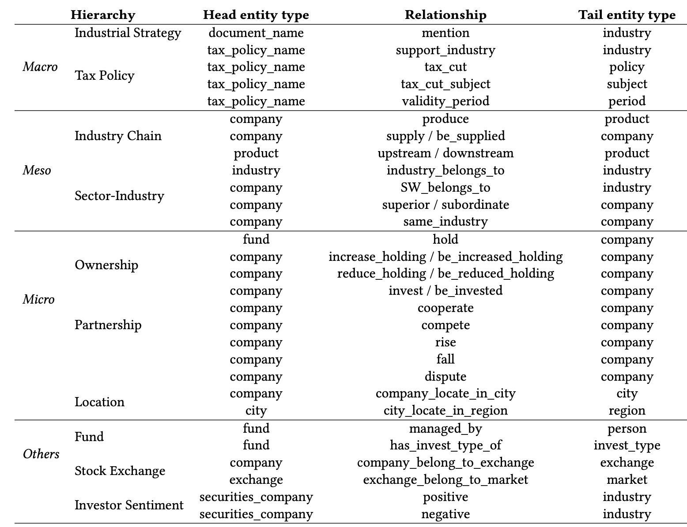

<div align="center">
<h1>HiDy Dataset</h1>


[[Website]](http://lccpu22.cse.ust.hk:8003/new/index.html#/kquant)
[[Arxiv Paper]]()
[[Open Database]](https://zenodo.org/record/8219047)
[[Team]](http://143.89.126.57:8003/fintech.html)


<!-- [](https://pypi.org/project/MineDojo/) -->
[](https://github.com/K-Quant/HiDy)
[](https://github.com/K-Quant/HiDy/issues)
[](https://github.com/K-Quant/HiDy/pulls)
[](https://github.com/K-Quant/HiDy/stargazers)
[](https://github.com/K-Quant/HiDy/blob/main/LICENSE)
[](https://github.com/K-Quant/HiDy)


<p align="center"> A Large-scale Hierarchical Dynamic Financial Knowledge Base</p>


</div><br>


 HiDy is a hierarchical, dynamic, robust, diverse, and large-scale financial benchmark KB that aims to provide various valuable financial knowledge as critical benchmarking data for fair model testing in different financial tasks. Specifically, HiDy currently contains 34 relation types, more than 492,600 relations, 17 entity types, and more than 51,000 entities. The scale of HiDy is steadily growing due to its continuous updates. To make HiDy easily accessible and retrieved, HiDy is organized in a well-formed financial hierarchy with four branches, *Macro*, *Meso*, *Micro*, and *Others*.

With HiDy, users can apply more in-depth, professional, logical, and interpreted knowledge to many common financial tasks, such as stock movement prediction (SMP), financial fraud detection (FFD), supply chain management (SCM), loan default risk prediction (LDRP) and financial event prediction (FEP).


🎉 **NEWS**: 
- We have open-sourced the `Benchmarking Models of SMP and FFD Tasks` along with the test data.
- We have open-sourced the `Stock Movement Prediction and Backtesting Demo Website` equipped with HiDy's knowledge.
- We have open-sourced the `Pre-trained Extraction Models`.
- We have open-sourced the `Knowledge Extraction Implementation`.
- We have published the 1.0 version of the hierachical dynamic financial knowlegde base `HiDy` in [Zenedo](https://zenodo.org/record/8219047).


# Contents

- [Installation](#installation)
- [Description](#description)
- [Applications](#applications)
- [License](#license)

# Installation
To install the cutting edge version of `Knowledge Extraction Implementation` from the main branch of this repo, run:
```bash
git clone https://github.com/K-Quant/HiDy.git
cd HiDy
pip install -r requirements.txt
```

# Description
Our databases is open-access and available in [Zenedo](https://zenodo.org/record/8219047)! The data description is shown in the following table:


- HiDy owns the metadata and releases as [CC BY-NC 4.0](http://creativecommons.org/licenses/by-nc/4.0/).
- HiDy owns the copyright of the extracted data denoted by their relation type: mention, support_industry, tax_cut, tax_cut_subject, validity_period, supply / be_supplied, upstream / downstream, superior / subordinate, same_industry, increase_holding / be_increased_holding, reduce_holding / be_reduce_holding, invest / be_invested, cooperate, compete, rise, fall, dispute, positive, negative as [CC BY-NC 4.0](http://creativecommons.org/licenses/by-nc/4.0/).
- HiDy does not own the copyright of the collected data by querying the Internet denoted by their relation type: SW_belongs_to, industry_belongs_to, hold, managed_by, has_invest_type_of, company_belong_to_exchange, exchange_belong_to_market, company_locate_in_city, city_locate_in_region, produce.


# Applications
We present multiple benchmarking results for SMP and FFD tasks to foster community involvement in HiDy paper.

## SMP Demo
The [Website](http://lccpu22.cse.ust.hk:8003/new/index.html#/kquant) provides users with various stock movement prediction models with backtesting. Among them, HIST and NRSR are equipped with HiDy dataset.


# License

Although the validation results are promising, HiDy is $not$ a completed data product. Given the vast scale of financial research across various markets, refining HiDy for widespread adoption exceeds the capacity of a single paper. As such, we firmly suggest utilizing HiDy exclusively for academic research purposes in its present state. We caution against employing it in deployed systems without thoroughly examining the behavior and potential biases of models trained on HiDy.

The codebase (this repo) is licensed under a [Apache 2.0 License](LICENSE).
<a rel="license" href="http://creativecommons.org/licenses/by-nc/4.0/"></a><br />The HiDy dataset is licensed under a <a rel="license" href="http://creativecommons.org/licenses/by-nc/4.0/">Creative Commons Attribution-NonCommercial 4.0 International License</a>.


